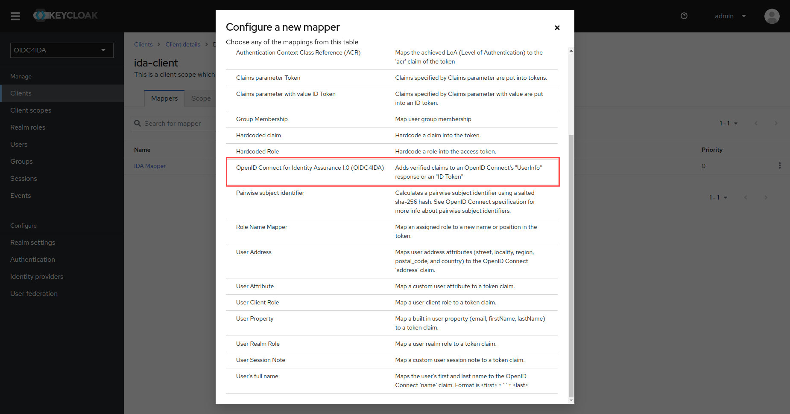
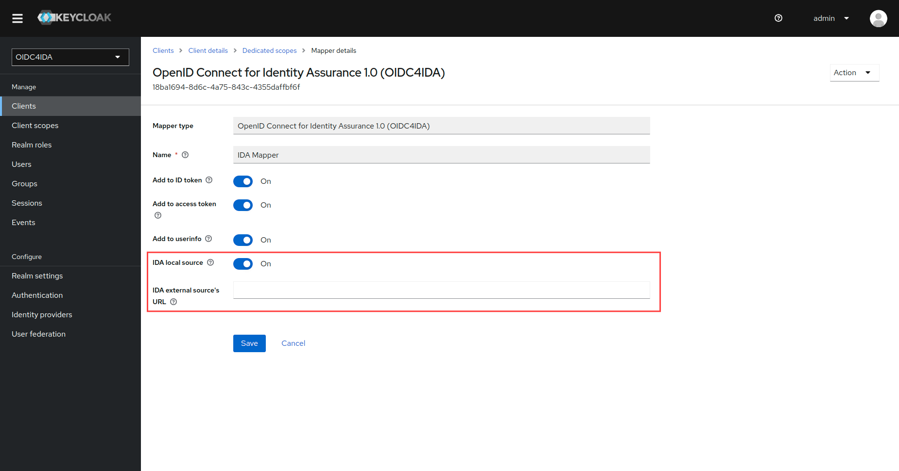

# ⚜️ OpenID Connect for Identity Assurance (OIDC4IDA) on Keycloak
This project's aim is to implement support for the [OpenID Connect for Identity Assurance 1.0 (ODIC4IDA)](https://openid.net/specs/openid-connect-4-identity-assurance-1_0.html) protocol on Keycloak, using a custom `Service Provider`. The project is designed to enable Keycloak to receive, process, and respond to requests and responses from the OIDC4IDA protocol. This implementation fulfills all the specified requirements outlined in the protocol's specification: it incorporates advanced functionalities such as conducting JSON schema validations for verified claims' requests and objects; additionally, it allows the storage of verified claims within Keycloak's local database, or their retrieval from an external verification server.

Most of the magic happens thanks to `authlete-java-common` library (the documentation can be [accessed here](https://github.com/authlete/authlete-java-common)). It allows the processing of OIDC4IDA requests and it is [recognized as one of the standards protocol implementations](https://bitbucket.org/openid/ekyc-ida/wiki/Implementations) by the eKYC & Identity Assurance WG. All of the JSON objects manipulated in this code are validated using [JSON schemas provided by the protocol development team](https://bitbucket.org/openid/ekyc-ida/src/master/schema/). This is done with help of the `jsonschemafriend` library (the documentation page [can be found here](https://github.com/jimblackler/jsonschemafriend)).

## 🛠️ Usage
To utilize this extension and its functionalities, follow these steps:

1. Copy the file `keycloak/extensions/keycloak-oidc4ida.jar` into the `providers/` directory of your Keycloak installation.

1. Upon server initialization, a new protocol mapper should become available: 

1. Configure the mapper according to your requirements. You can choose between consuming verified claims from Keycloak's local database or specifying the URL of an external source: 

Once correctly set up, Keycloak will recognize the verified claims' requests that adhere to [this JSON schema](keycloak/extensions/src/main/resources/schema/verified_claims_request.json), and will retrieve users' verified claims from the specified source. User's verified claims should also adhere to [their own JSON schema](keycloak/extensions/src/main/resources/schema/verified_claims.json). If stored in Keycloak's local database, they should be part of a user's attribute, labeled as `verified_claims`.

## 🔬 Running the demo
A demonstrative environment has been set up and is available so the extension can be seen in action. The environment includes a Keycloak instance with a realm named `OIDC4IDA`. This realm has a client, `ida-client`, configured to use the OIDC4IDA protocol mapper. A single user has been configured, with one set of verified claims, specified in [this file](). The user's credentials are `ida_user` (username) and `123` (password).

To run the demo, execute the following commands in a terminal:
```bash
chmod +x dev.sh
./dev.sh run
```

[Postman](https://www.postman.com/) can be used to actively send verified claims requests and receive responses. A [collection file](requests/postman/OIDC4IDA.postman_collection.json) is also provided, with a set of request examples and a pre-configured environment for you to play around.

## ⚠️ Attention
In order to be able to store users' verified claims locally, Keycloak's database had to be modified. This is done automatically when the extension is loaded, and should cause no problems at all. The `USER_ATTRIBUTE` table has had its column `VALUE` length changed from `255` to `MAX`. This modification should be handled with care, and it is recommended to do a backup of your application's database before loading the extension.